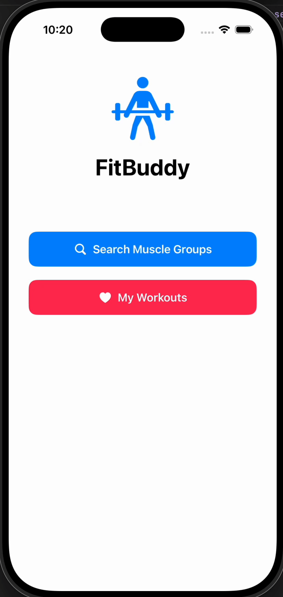

Fit Buddy

Demo and code walkthrough

 [Demo Video](https://youtu.be/UF9c-hSj37c)

Table of Contents
1. Overview
2. ProductFit Buddy
Table of Contents
1. Overview
2. Product Spec
3. Wireframes
4. Schema

Overview
Description FitRoutine is a workout routine app designed to help users stay consistent with their fitness goals. The app connects to a public exercise database API to fetch exercises based on muscle groups, difficulty, or equipment. Users can browse exercises, view instructions, and create personalized workout routines. The app also lets users save routines to their Back4App account, making it easy to access their workouts across devices.

App Evaluation
* Category: Health and Fitness
* Mobile: Yes
* Story: The app helps users stay consistent with their fitness goals by giving them an easy way to discover exercises, build custom routines, and track their workouts.
* Market: Beginner to intermediate gym goers who want a simple but effective app for fitness.
* Habit: Meant to be used whenever the user workout, whether it be at home or at the gym.
* Scope: Narrow to medium. It doesn’t include advanced features like calorie tracking, community feeds, or professional coaching.

Product Spec
1. User Stories (Required and Optional) Required Must-have Stories
* [X]User can register an account using Back4App
* [X]User can log in and log out
* [X]User can view a searchable list of exercises fetched from an API
* [X]User can filter exercises by muscle group or difficulty
* [X]User can tap an exercise to view detailed instructions
* [X]User can save their routines

Optional Nice-to-have Stories
* [X]User can edit or rename an existing routine
* [X]User can reorder exercises within a routine
* [X]User can track workout history or completed sessions
* []User can favorite exercises for quick access
* []User can upload a profile picture

1. Screen Archetypes 
1. Login Screen -Required User Feature: User can log in. -Required User Feature: User can register an account. -Required User Feature: User can reset their password (optional).
2. Exercise List Screen -Required User Feature: User can view a searchable list of exercises from the API. -Required User Feature: User can filter exercises by muscle group or difficulty.
3. Exercise Detail Screen -Required User Feature: User can tap an exercise to see detailed instructions. -Optional Feature: User can favorite or save an exercise.
4. Routine Builder Screen -Required User Feature: User can create a custom workout routine. -Required User Feature: User can add exercises to a routine. -Required User Feature: User can remove exercises from a routine.
5. Saved Routines Screen -Required User Feature: User can view all saved routines stored in Back4App. -Optional Feature: User can edit or rename an existing routine. -Optional Feature: User can reorder exercises within a routine.
6. Workout Session Screen -Required User Feature: User can follow a routine step-by-step. -Optional Feature: User can mark exercises as completed. -Optional Feature: User can track workout history.
7. Navigation

Tab Navigation
* Exercises Tab
* Shows: Exercise List Screen
* Routines Tab
* Shows: Saved Routines Screen
* Profile Tab
* Shows: Profile Screen

Wireframes 
[BONUS] Digital Wireframes & Mockups

Prototype

Schema
Models [Model Name, e.g., User] Property Type Description username String unique id for the user post (default field) password String user's password for login authentication objectId String User ID email string Users email createdAt date Date of account creation updatedAt date Last update time apiId string ID of external API for exercises name string Exercise name muscleGroup string Primary muscle group equipment string Equipment required for exercise difficulty string Difficulty level instructions string Instructions for form exerciseId string ID from exercise API exerciseName string Cached name of exercise Sets Number Number of sets reps number Number of reps Networking List of Network Requests by Screen Login Screen [POST] Parse User Login – authenticate user [POST] Parse User Sign Up – create new account

Exercise List Screen [GET] External Exercise API – fetch list of exercises by muscle group / query (Optional) [GET] Parse /favorites – fetch user’s favorite exercises
Exercise Detail Screen Uses data from Exercise List request (Optional) [POST] Parse Favorite – save exercise as favorite

Routine Builder Screen [GET] External Exercise API – search exercises to add [POST] 

Parse Routine – create new routine [PUT] Parse Routine – update routine’s exercise list

Saved Routines Screen [GET] Parse Routine – fetch all routines for current user
